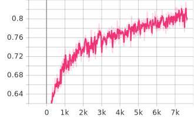
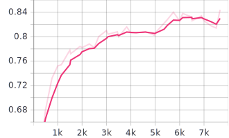
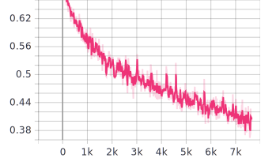
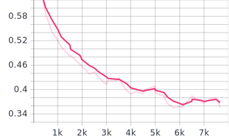

# Image Classifier with Deep Learning

Image credit from [Mentalfloss.com](https://www.mentalfloss.com/article/516438/8-tricks-help-your-cat-and-dog-get-along)

### Introduction
This is my 🐶 vs 🐱 image classifier with **Convolutional Neural Networks (CNNs) using Tensorflow 1.x and TFLearn**. I have created this after following a couple of tutorials from [Sentdex](https://pythonprogramming.net/). This is merely a test and practice, I do not own the dataset that is being used and most of my codebase is heavily influenced by Sentdex's tutorials.

### Requirements
- Tensorflow 1.15.0-rc2
- TFLearn 0.3.2
- Tqdm 4.36.1
- Numpy
- Matplotlib

### Usage
- 1.) Download the dataset from [Kaggle](https://www.kaggle.com/c/dogs-vs-cats-redux-kernels-edition#)
- 2.) Extract the files on the data folder
- 3.) After extracting, go inside the data folder and extract the train and test into their respective folders
- 4.) Tweak the network and model settings by following the instructions below (Tweaking network and model)
- 5.) Run `python3 train.py` on your terminal to train the model
- 6.) Wait for the training to be finished, run `tensorboard --dirlog=log` on your terminal to see the performance of the training
- 7.) Run `python3 test.py` to test your model's accuracy
- 8.) Run `python3 main.py --image some/path/to/image.jpg` to predict whether your image is a 🐶 or a 🐱
 
### Tweaking network and model
By default, the `LEARNING_RATE` is set to `1e-4` or `0.0001` while the `DROPOUT_RATE` is set to `0.8`, you can change this by opening `settings.py` and editing their values.

For the model that I'm using, I already implemented `Image PreProcessing` and `Image Augmentation`, in order to add or remove preprocessing functions or augmentation functions, checkout [TFLearn's documentation](http://tflearn.org/).

Additionally, the model is structured to be have 4 hidden layers, you can change this by opening `model.py` and add or remove hidden layers to your desired quantity.

The model will train for 20 epochs*, open `train.py` and edit the `n_epoch` parameter on *line 51* to change the number of epochs

*an epoch refers to one cycle through the full training dataset.

### My Results
Below are images from my Tensorboard. For someone who had a hard time understanding Deep Learning like me, I believe this is a satisfactory result, although I'm still aiming for a much better number.

Accuracy

Accuracy Validation

Loss

Loss Validation

### Notes
I'm satisfied with what I've accomplished so far, there are lots of rooms for improvement and I plan on achieving them all. However, I plan on moving forward into Tensorflow 2.0 and Keras in the next few weeks/months, as suggested by many. So this will be my only TFLearn project.
